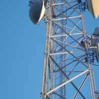
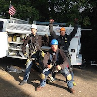

GRaas Corp is based in the Lehigh Valley of Pennsylvania. We were founded in 2013 to service cell towers in the northeastern United States. We have since expanded and now complete work nationwide.

&nbsp;

